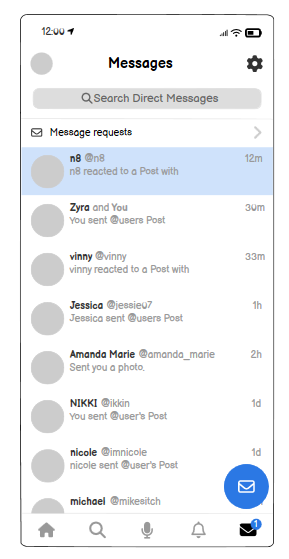
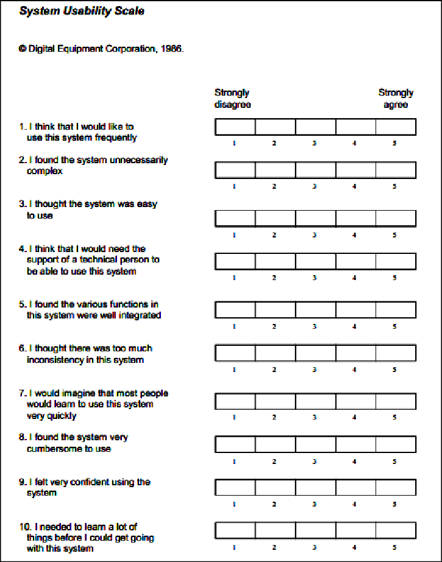

# Themeninput Modul 322 - Benutzerfreundlichkeit / Testen

# Inhaltsverzeichnis

- [Themeninput Modul 322 - Benutzerfreundlichkeit / Testen](#themeninput-modul-322---benutzerfreundlichkeit--testen)
- [Inhaltsverzeichnis](#inhaltsverzeichnis)
  - [Prototype](#prototype)
    - [Frühzeitiges Feedback](#frühzeitiges-feedback)
    - [Navigation testen](#navigation-testen)
  - [Benutzerfreundlichkeit testen](#benutzerfreundlichkeit-testen)
    - [SUS - System Usability Scale](#sus---system-usability-scale)
    - [HEART - Happiness, Engagement, Adoption, Retention, and Task Success](#heart---happiness-engagement-adoption-retention-and-task-success)
  - [Barrierefreiheit](#barrierefreiheit)
    - [Anforderungen](#anforderungen)
      - [WCAG - Web Content Accessibility Guidelines](#wcag---web-content-accessibility-guidelines)
      - [WAI-ARIA - Accessible Rich Internet Applications](#wai-aria---accessible-rich-internet-applications)
    - [Testmöglichkeiten](#testmöglichkeiten)
      - [Mögliche Screenreader:](#mögliche-screenreader)
- [Quellenverzeichnis](#quellenverzeichnis)

## Prototype

Ein Prototype im Form eines Wireframes ist sehr nützlich.  
Die meisten Mockup-Tools bieten Elemente, die man auch klickbar machen kann.  
Um ein Beispiel zu erhalten wie so ein Prototype aussehen könnte wurde mit klickbaren Eigenschaften wurde ein Mockup über `Balsamiq Wireframes` eingefügt.

### Frühzeitiges Feedback

Wireframes sind schnell und günstig erstellt und können dazu verwendet werden um schon in der frühen Phase Nutzerfeedback zu erhalten.

### Navigation testen

Man kann testen, ob Benutzer intuitiv durch die Applikation navigieren können.

[zum Beispiel](./assets/mockup-prototype/)

## Benutzerfreundlichkeit testen

### SUS - System Usability Scale

- **Erläuterung**
  - SUS ist ein einfaches, zehn Fragen umfassendes Bewertungsinstrument, das eine schnelle Einschätzung der Usability eines Systems ermöglicht.

### HEART - Happiness, Engagement, Adoption, Retention, and Task Success

- **Erläuterung**
  - HEART ist ein Framework zur Bewertung von Benutzererfahrungen, basierend auf fünf Metriken: Glück, Engagement, Akzeptanz, Bindung und Aufgabenerfolg.
- **Zusammenfassung**
  - Diese Metriken helfen dabei, verschiedene Aspekte der Nutzerinteraktion und -zufriedenheit zu verstehen und zu optimieren.

## Barrierefreiheit

### Anforderungen

#### WCAG - Web Content Accessibility Guidelines

- **Richtlinien**
  - WCAG bietet Richtlinien, um Webinhalte für Menschen mit verschiedenen Arten von Behinderungen zugänglich zu machen.
- **Wichtigkeit**
  - Die Einhaltung der WCAG ist entscheidend, um eine inklusive Webumgebung zu schaffen.

#### WAI-ARIA - Accessible Rich Internet Applications

- **Standards**
  - WAI-ARIA definiert, wie Webinhalte und Webanwendungen für Menschen mit Behinderungen, insbesondere für die dynamischen Inhalte und fortgeschrittenen Benutzerinterface-Komponenten, zugänglicher gemacht werden können.
- **Anwendung**
  - Sie ergänzt HTML um zusätzliche Attribute, um die Zugänglichkeit zu verbessern.

### Testmöglichkeiten

- **Screen-Reader und andere Tools**
  - Der Einsatz von Screen-Readern und anderen Zugänglichkeitstools ist unerlässlich, um die Einhaltung der Barrierefreiheitsstandards sicherzustellen und die Webinhalte für alle Nutzergruppen zugänglich zu machen.

#### Mögliche Screenreader:

- NVD (NonVisual Desktop)
- Serotek System Access
- Apple VoiceOver
- Orca

# Quellenverzeichnis

[Balsamiq Beispielprojekt](https://wireframestogo.com/db67-Social-Feed-Mobile-App/)  
[SUS Bild](https://www.google.com/url?sa=i&url=https%3A%2F%2Fwww.researchgate.net%2Ffigure%2FSystem-Usability-Scale-SUS-questionnaire_fig9_270686334&psig=AOvVaw23dKuGuH_tJjJTaDzkchpW&ust=1703086992996000&source=images&cd=vfe&opi=89978449&ved=0CBEQjRxqFwoTCMis_M3rm4MDFQAAAAAdAAAAABAf)
